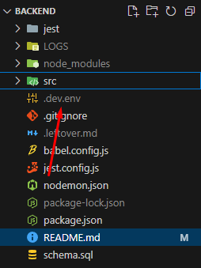
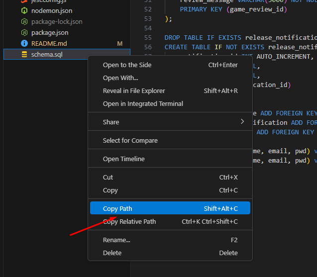

# DESCRIPTION

## HOW TO START THE PROJECT (BACKEND & FRONTEND)
- npm install
- have a file named ".dev.env" with this specific RAWG_API_KEY (or your own) and your 
own MySQL settings located in the root folder
    ```
    RAWG_API_KEY=1171c434bf61477aa696aaf01f44fa21
    SERVER_PORT=5555
    DB_USER=root
    DB_PWD=abc-123
    DB_PORT=3306
    DB_HOST=localhost
    DB_NAME=game_picker_dev
    ```

- log in to your MySQL service (mysql -u root -p) to use the command "source (path to schema.sql or just right click schema.sql and copy path)"



- npm run dev

## DESC 
- [rawg](https://api.rawg.io/docs/) is the api that we used
    - the data isn't stored, but used in realtime as needed in the catalog page
- passwords are encrypted
- ...

## REF
- [fix __dir](https://stackoverflow.com/questions/64383909/dirname-is-not-defined-error-in-node-js-14-version)
- [env?](https://stackoverflow.com/questions/77498008/nodemon-not-loading-env-variables-in-node-js-20-9-0-undefined)
